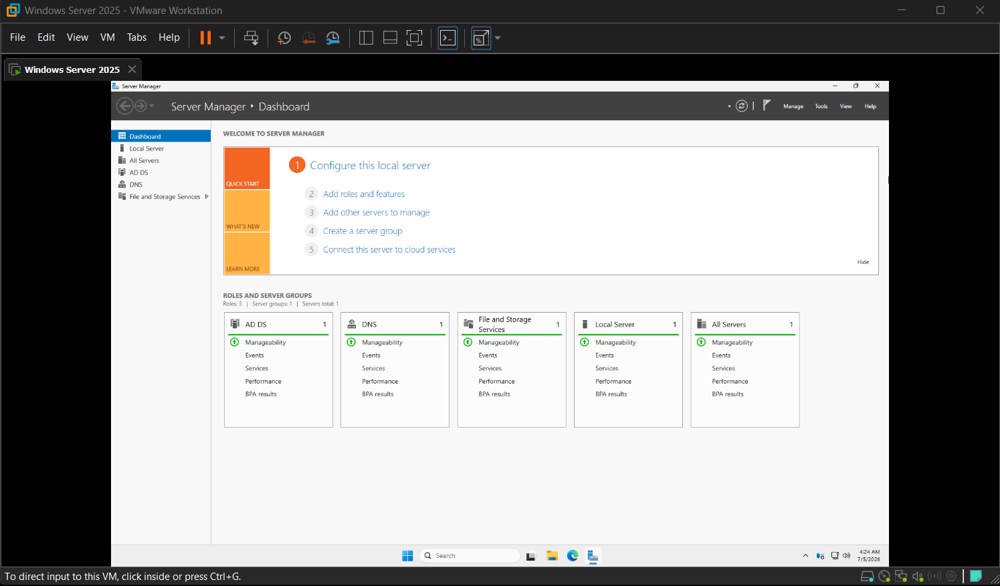
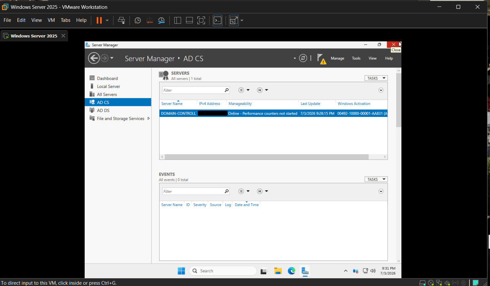
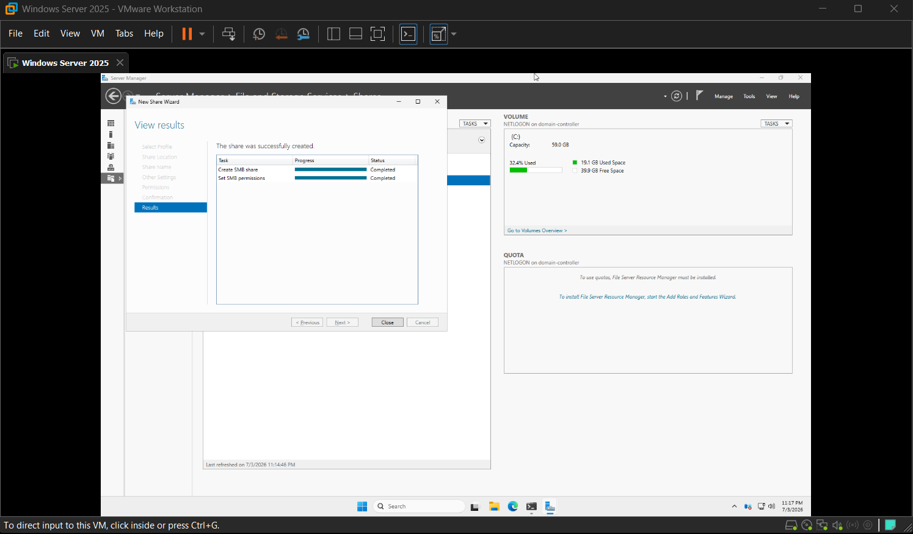

# Setup Guide

## 1. Base server

Windows Server 2025 running as a VM in VMware Workstation.

## 2. Install AD DS and promote to Domain Controller

Installed the AD DS role and promoted the server to a domain controller. Once complete, Server Manager shows AD DS, DNS, and File and Storage Services as active roles.

Script: [`scripts/install-ad-ds.ps1`](../scripts/install-ad-ds.ps1)

## 3. Install AD CS

Installed the Active Directory Certificate Services role on the domain controller (`DOMAIN-CONTROLL`).

Script: [`scripts/install-ad-cs.ps1`](../scripts/install-ad-cs.ps1)

## 4. Create an SMB share

Used the New Share Wizard in Server Manager (File and Storage Services) to create an SMB share (NETLOGON) on the `C:` volume, with SMB permissions set.

Script: [`scripts/create-smb-share.ps1`](../scripts/create-smb-share.ps1)

## Result

- Domain controller online with AD DS, AD CS, DNS, and File and Storage Services running.
- Volume `(C:)` — 59.0 GB capacity, ~32% used.
- SMB share created successfully with permissions applied.
